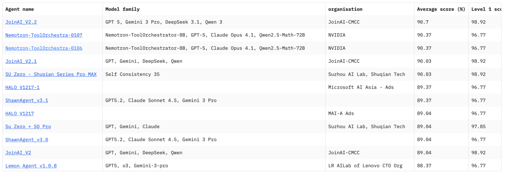
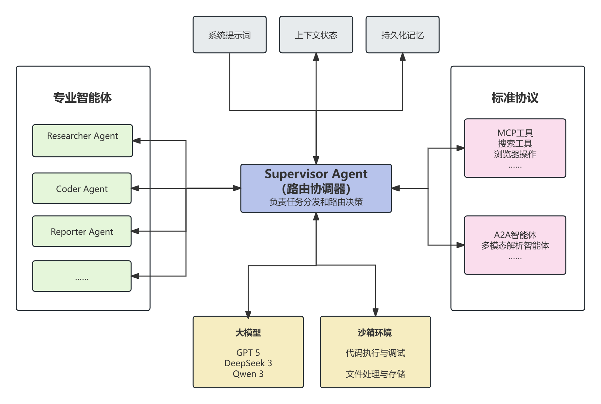
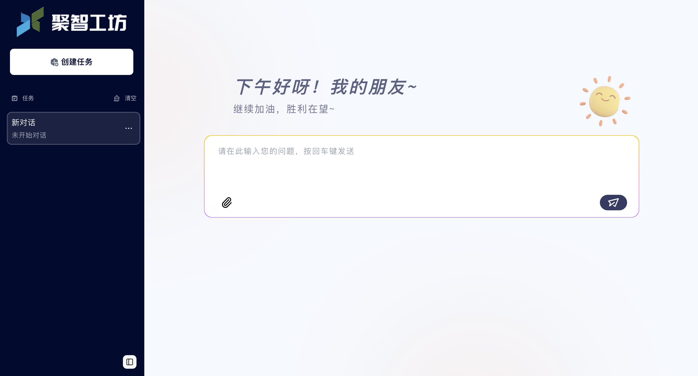

# JoinAI-Agent

<table>
<tr>
<td width="200" valign="top">


</td>
<td valign="top">

JoinAI-Agent 诞生于中国移动自主研发的九天·聚智智能体平台。作为一款"会思考、会行动"的AI智能体，JoinAI-Agent率先定义新一代企业级智能体引擎核心能力，面向复杂任务场景，系统性构建了从感知、规划、执行到协同的完整智能体能力闭环，标志着中国移动在通用智能体系统领域取得重要突破。JoinAI-Agent的开源将打破技术壁垒，加速产业协作，为千行百业智能升级持续赋能。

此次我们开源了JoinAI-Agent的标准框架和基础能力，整个系统采用前后端分离的架构，前端支持附件上传、沙箱任务跟踪等，后端基于DAG 执行引擎，内置多个专业子智能体（如信息整合、代码专家、报告生成等）和丰富的工具生态（如搜索、文件处理等）。

</td>
</tr>
</table>

## 📑 目录

[English README](README_EN.md) | [框架性能](#框架性能) | [项目架构](#项目架构) | [快速开始](#快速开始) | [示例演示](#示例演示)

## 📋 框架性能 <a id="框架性能"></a>

在GAIA基准测试中，JoinAI-Agent综合成绩达到90.70，位列榜单第一名。



## 🏗️ 项目架构 <a id="项目架构"></a>



本开源项目开源了前端、智能体的react模式、多个子智能体（reporter、researcher、coder）、多种标准化交互协议、沙箱等。

### **特点和优势**

- **端到端完整的产品**：一键部署，开箱即用，支持二次开发和定制化扩展
- **标准化协议支持**：集成 MCP 和 A2A 协议，支持工具和智能体的可插拔扩展
- **安全的沙箱执行**：基于 E2B 沙箱环境，提供安全的代码执行能力，支持 Shell、文件操作、浏览器自动化等
- **灵活的架构设计**：前后端分离，模块化设计，便于集成和维护

### **核心功能**

JoinAI-Agent是一个功能强大的智能体引擎，集成了以下核心能力：
- 🔧 **工具集成**：支持网页搜索、文件操作、代码执行等多种工具
- 🤝 **A2A支持**：支持 A2A 协议，实现智能体间的协作
- 🔌 **MCP支持**：集成 MCP协议，支持扩展工具
- 🖥️ **沙箱执行**：安全的代码执行环境
- 💬 **Web界面**：简洁易用的前端界面，支持附件上传
- 🌐 **Browser-Use**：支持浏览器自动化操作，包括点击、输入、滚动等操作，实现自动化网页交互和任务执行

## 🚀 快速开始 <a id="快速开始"></a>

### 前置要求

- Docker 和 Docker Compose
- Python 3.12+（本地开发）
- Node.js 20+（本地开发）

### 使用 Docker Compose 部署（推荐）

1. **克隆项目**

```bash
git clone https://github.com/opencmit/JoinAI-Agent.git
cd JoinAI-Agent
```

2. **配置环境变量**

后端服务：复制 `backend/.env.template` 文件为 `backend/.env`，在 `.env` 文件中填写必要的密钥，模型和沙箱为必须配置项，E2B_API_KEY可在https://e2b.dev/进行申请：

**模型示例：**

```env
# OpenAI 官方 API
OPENAI_BASE_URL=https://api.openai.com/v1
OPENAI_API_KEY=sk-your-openai-api-key-here
BASE_LLM=gpt-5
```

```env
# 兼容其他模型API服务
OPENAI_BASE_URL=https://api.siliconflow.cn/v1
OPENAI_API_KEY=your-api-key
BASE_LLM=deepseek-ai/DeepSeek-V3.2-Exp
```
若需使用搜索JINA、SERPER、Bocha搜索工具，需申请JINA_API_KEY（https://jina.ai/）、SERPER_API_KEY（https://serper.dev）、BOCHA_API_KEY（https://bocha.cn/）并填入.env

前端服务：复制 `frontend/.env.template` 文件为 `frontend/.env`，在 `.env` 文件中填写必要的密钥，其中 `E2B_API_KEY` 需和后端 `.env` 中的 `E2B_API_KEY` 保持一致

A2A智能体：已接入图片解析智能体，若使用该智能体，需复制 `backend/a2a_agent/pic_agent/.env.template` 文件为 `backend/a2a_agent/pic_agent/.env`,在 `.env` 文件中填写VL模型相关信息,通过附件形式上传图片。
```env
OPENAI_BASE_URL=https://dashscope.aliyuncs.com/compatible-mode/v1
OPENAI_API_KEY=sk-your-openai-api-key-here
BASE_LLM=qwen-vl-plus
```


3. **启动服务**

```bash
docker-compose up -d
```

4. **访问应用**

- 前端界面：http://localhost:9094



- 后端 API：http://localhost:18100

### 本地开发

#### 后端开发

```bash
cd backend
pip install -r requirements.txt

# 测试后端服务
python test_demo.py
```

#### 前端开发

```bash
cd frontend
pnpm install
pnpm dev
```

### MCP 配置

MCP 工具配置在 `backend/config/mcp_server.json`，目前已配置Serper、Jina搜索工具，配置对应秘钥后即可使用。支持用户自行配置 MCP 工具。

### A2A配置
A2A智能体配置在 `backend/config/a2a_server.json`，目前已配置图片解析智能体，配置对应秘钥后即可使用。支持用户自行配置A2A智能体。

## 📹 示例演示 <a id="示例演示"></a>

<table>
<tr>
<td width="50%">

**Browser-Use**
在`backend/config/mcp_server.json`browser-use部分填入秘钥（https://cloud.browser-use.com/），则可以通过浏览器工具自动操作网页，包括点击、输入、滚动等操作，实现自动化网页交互和任务执行。

https://github.com/user-attachments/assets/a161f4fa-c894-4ecd-b415-defd3bdf2dbf

</td>
<td width="50%">

**A2A_图片解析**
已通过A2A接入图片解析智能体，在`backend/a2a_agent/pic_agent/.env`中配置VL模型信息，通过附件上传图片即可使用。

https://github.com/user-attachments/assets/3fc43ca2-f5b6-461f-a62e-4f4b18e58e44

</td>
</tr>
<tr>
<td width="50%">

**报告编写**
输入报告主题，在`backend/.env`中填入Serper、Jina秘钥，通过调用Serper、Jina等搜索工具收集主题相关信息，由报告智能体完成报告编写。

https://github.com/user-attachments/assets/37a83da1-def8-415b-b125-9c4d651acc45

</td>
<td width="50%">

**附件处理**
支持上传多种格式的附件文件，智能体可以读取和处理附件内容，包括文本文件、图片等，针对文本附件进行markdown格式转换后进行后续任务。

https://github.com/user-attachments/assets/b50b0535-fba5-4933-a648-772ff02d7ce0

</td>
</tr>
</table>

## 🔒 安全注意事项

- 沙箱环境默认启用，确保代码执行安全
- 敏感配置通过环境变量管理
- API 密钥不要提交到代码仓库

## 📝 ToDoList
- [ ] plann推理模式
- [ ] 更多工具支持
- [ ] 多智能体记忆
- [ ] 丰富的执行环境

## 📄 许可证

本项目采用 [Apache License 2.0](LICENSE) 开源许可证。

---

**注意**：本项目正在积极开发中，API 和配置可能会发生变化。建议查看最新文档和代码更新。


